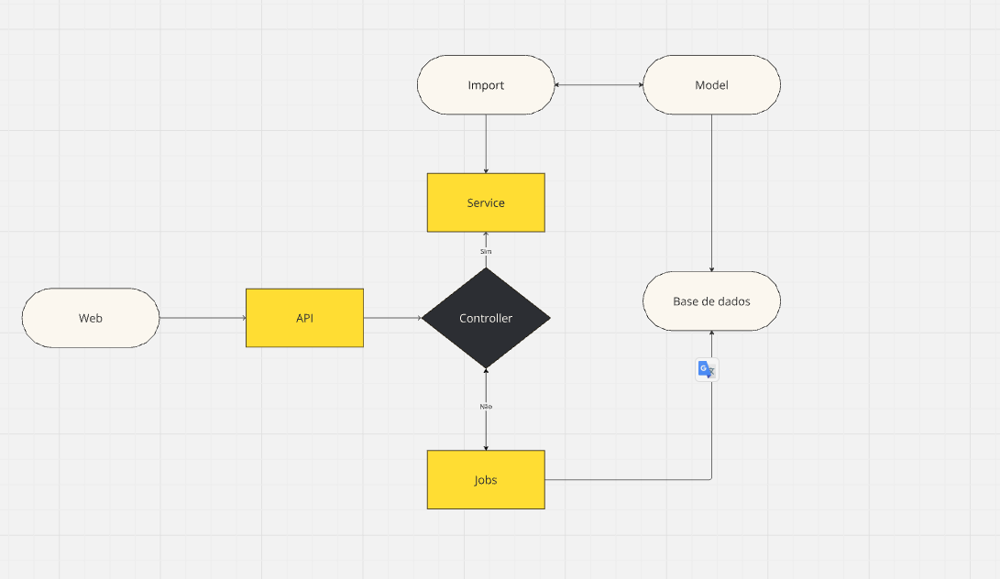

# Processamento de arquivos CSV. 

O objetivo desse projeto é processar a entrada de um arquivo csv contendo mais de 500.000 (Quinhentas mil) linhas em poucos minutos. 

## ⚙️ Um pouco sobre a organização do projeto

O projeto esta divido em camadas. 

Controllers, Validações, Services, Models, Job e Por ultimo a base de dados princimpal com Mysql. O teste
Ultiliza Redis para processamento de Jobs.



## 🚀 Começando

Essas instruções permitirão que você obtenha uma cópia do teste feito por mim.

### 📋 Pré-requisitos

O que vai precisar para instalá-lo?

Docker, Mysql, Git , Redis e Laravel

Esse teste ultiliza docker, então todos os serviços estão no docker-compose.

```
https://www.docker.com/
```

### 🔧 Instalação

Uma série de exemplos passo-a-passo que informam o que você deve executar para ter um ambiente de desenvolvimento para a execução do teste.

Baixar o Docker.

```
Link para dowload: https://www.docker.com/
```
Clonar o repositorio do github

```
https://github.com/guilherf13/Soft-Engineers-Backend-Test.git
```
Entre dentro da pasta backend

```
cd backend
```
Execute o comando para subir os containers do docker.

```
docker compose up -d
```
Crie o arquivo.env

```
cp .env.example .env
```
Subistitua essa configuração pela que esta no seu .env

```
DB_CONNECTION=mysql
DB_HOST=mysql
DB_PORT=3306
DB_DATABASE=laravel
DB_USERNAME=username
DB_PASSWORD=userpass

SQUEUE_CONNECTION=redis

CACHE_STORE=redis
CACHE_PREFIX=laravel_cache
FILESYSTEM_DRIVER=redis

#MEMCACHED_HOST=127.0.0.1

REDIS_CLIENT=phpredis
REDIS_HOST=redis
REDIS_PASSWORD=null
REDIS_PORT=6379
```

Acesse o container backend

```
docker compose exec backend bash
```

Instale as dependencia do projeto
```
composer install
```

Gere a key do projeto Laravel
```
php artisan key:generate
```

Rodar as migrations

```
php artisan migrate
```
Rodar os testes
```
php artisan test
```

### OBS: A documentação das APIs estão no arquivo Documentation.md, dentro da raiz do projeto.

## 🛠️ Construído com

* [Docker](https://www.docker.com/) - Gerenciador de serviços via containers
* [Mysql](https://www.mysql.com/) - Banco de dados para autenticação das apis
* [GIT](https://git-scm.com/downloads) - Controle de versão
* [Redis](https://rometools.github.io/rome/) - Usado para cache
* [Laravel](https://rometools.github.io/rome/) - Framework para web
